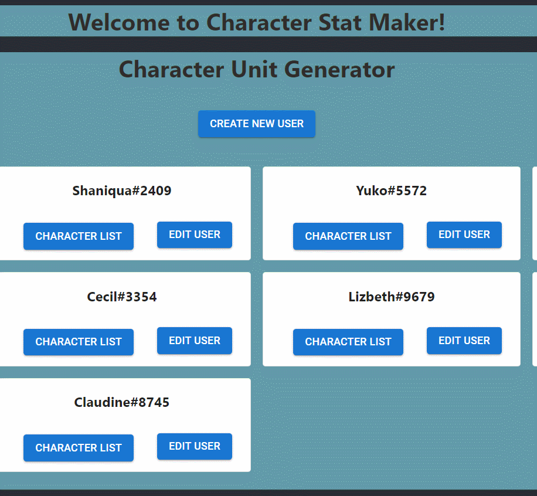
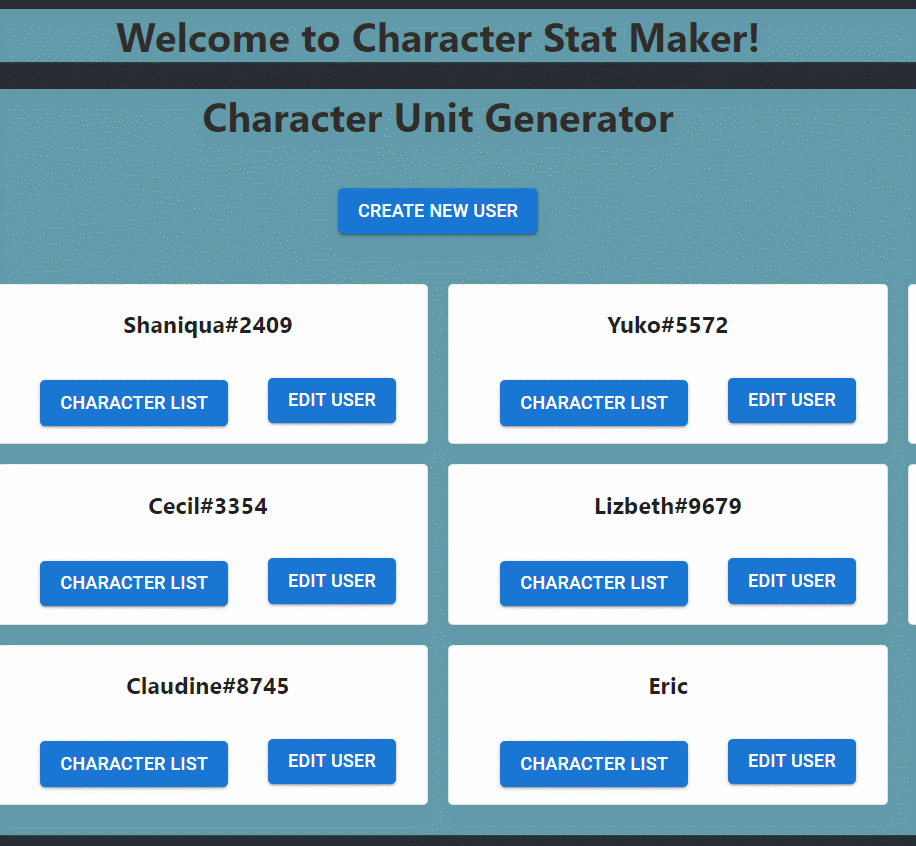
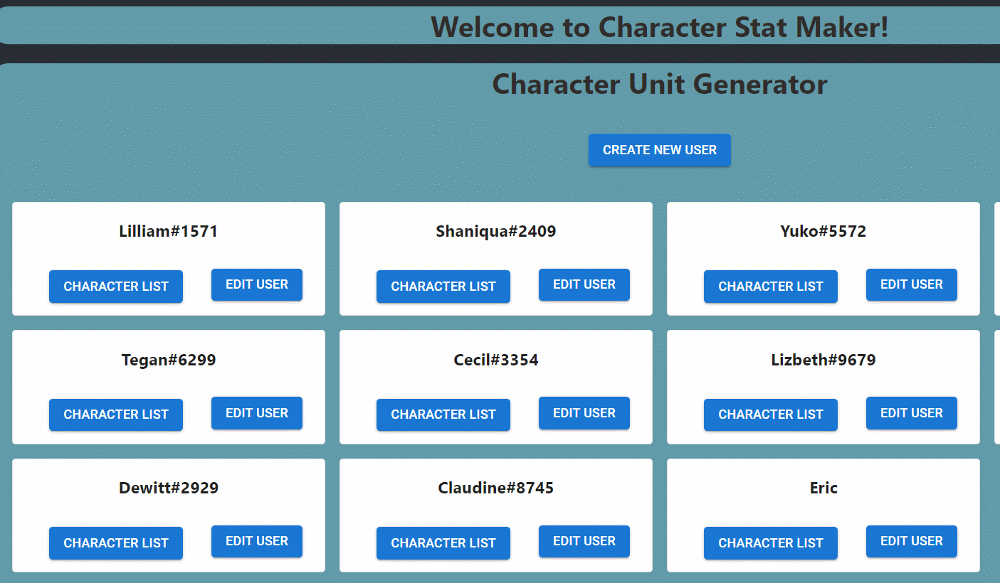

# Character Stat Maker (Frontend)

## Description

This application is designed to generate a simple user list as well as randomly generated video game character stats. The data used for this project is base loosely off the video game [Fire Emblem](https://en.wikipedia.org/wiki/Fire_Emblem). 

The site allows you to create your own username as well as randomly generated characters for each user. Users have the ability to change the names and jobs of each character but they are not allowed to change the stats of the characters.

This particular repository hosts the frontend of the application. You can use the randomly generated seed from the backend to play around with the application.

[Front End Repository](https://github.com/ericksong91/character-stat-maker-FE)

[Back End Repository](https://github.com/ericksong91/character-stat-maker-BE)

## Usage

1. You will be greeted by the homepage, which displays all users 

2. To create a new user, click on 'CREATE NEW USER' at the top of the user list

3. Typing a name into the field then clicking 'SAVE USER' will update the homepage with the new user

4. Clicking on 'EDIT USER' will allow the user to edit the username

5. Clicking on 'CHARACTER LIST' under any user will display all characters owned by that user

6. Clicking on 'HIRE NEW UNIT' will add a new character to that user

7. Clicking on 'DELETE CHARACTER' will delete that character from that user

8. Clicking on 'EDIT' will allow the user to edit the character's name and class but not stats

9. Clicking on 'RETURN TO USERLIST' will return the user to the homepage

## Examples:

Creating a new user:

Editing a user's name:

Modifying characters:

## Project Status

1/31/23 - Completed version 0.1

## Planned Features

1. Money system to hire characters

2. Add photos to characters

## Credits  

- [Fire Emblem](https://en.wikipedia.org/wiki/Fire_Emblem) for job names and stat formatting

## Author

This application is by Eric Song who is currently studying the Flex program at Flatiron School.

[Github](https://github.com/ericksong91)

[Linkedin](https://www.linkedin.com/in/eric-song-45597062)

## Contributing 
Pull requests are welcome. For major changes, please open an issue first to discuss what you would like to change.

Please make sure to update tests as appropriate.

## License
[MIT](https://choosealicense.com/licenses/mit/)